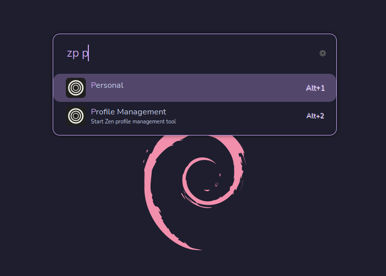

# Ulauncher Zen Profiles

An [Ulauncher](https://ulauncher.io) extension to open Zen with an user profile.

> Inspired by [Ulaucher Chrome Profiles Extension](https://github.com/FloydJohn/ulauncher-chrome-profiles)

## Screenshot

## Install

1. Open Ulauncher preferences
2. Enter "Extensions" Tab
3. Click "Add extension" on the left
4. Paste the url: `https://github.com/paulofilip3/ulauncher-zen-profiles`
5. Press "Add"

## Dependencies

You need to create the profiles first inside the `about:profiles` page in Zen. Just enter this url in the address bar and manage your profiles.

## Configuration

-  **Zen Profiles Keyword**: The keyword to activate the extension. Default: `zp`.

-  **Zen Configuration Folder**: Firefox profiles folder. You can find it inside the _"about:profiles"_ page. Default: `~/.zen/`

-  **Zen Executable**: The command line to start Zen. Usually _"zen"_. Default `zen`.
